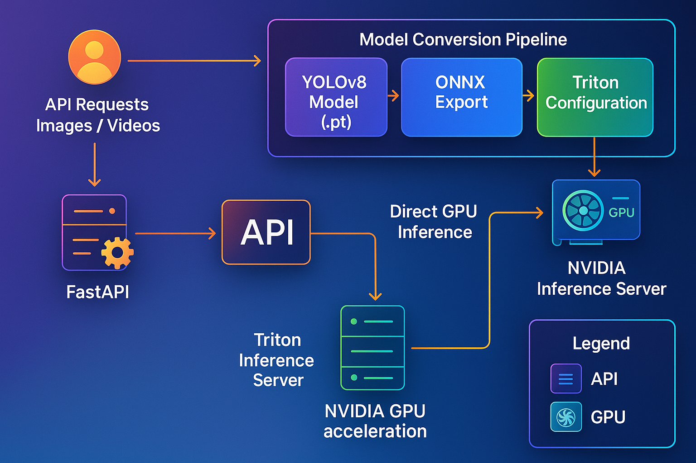

# YOLO Object Detection API with TensorRT and Triton

A high-performance object detection API built with FastAPI, YOLO, TensorRT, and NVIDIA Triton Inference Server. This project provides a complete solution for real-time object detection with GPU acceleration.


## 🔥 Features

- **High-performance inference** using YOLOv8-v9+ models
- **GPU acceleration** with TensorRT optimization
- **Scalable serving** with NVIDIA Triton Inference Server
- **Auto-configuration** for model conversion
- **RESTful API** with FastAPI
- **Multi-format support** for images and videos
- **Specialized endpoints** for traffic analysis
- **Prometheus metrics** for monitoring (Has not been implemented yet)
- **Flexible deployment** with Docker and Kubernetes (Kubernetes has not been implemented yet)

## 🛠️ Architecture



The system consists of three main components:

1. **Converter**: Converts YOLO models to TensorRT format for Triton
2. **Triton Server**: Serves optimized models with high throughput
3. **FastAPI**: Provides user-friendly endpoints for detection

## 🚀 Quick Start

### Prerequisites

- Docker and Docker Compose
- NVIDIA GPU with CUDA support
- NVIDIA Container Toolkit

### Running with Docker Compose

1. Clone the repository:
   ```bash
   git clone https://github.com/yourusername/yolo-k8s-api.git
   cd yolo-k8s-api
   ```

2. Start the services:
   ```bash
   docker-compose -f docker/docker-compose.yml up
   ```

3. The API will be available at http://localhost:8000/docs for the Swagger UI documentation

### Using the API

#### Detect Objects in an Image

```bash
curl -X POST http://localhost:8000/detect \
  -F "file=@/path/to/image.jpg" \
  -F "visualize=true"
```

#### Process a Video

```bash
curl -X POST http://localhost:8000/detect-video \
  -F "file=@/path/to/video.mp4" \
  -F "skip_frames=2"
```

#### Traffic Analysis

```bash
curl -X POST http://localhost:8000/detect/traffic \
  -F "file=@/path/to/traffic.jpg" \
  -F "count_vehicles=true"
```

## 🔧 Configuration

The system is configured using environment variables defined in the `docker-compose.yml` file. No separate `.env` file is needed.

### Default Model Configuration

```yaml
MODEL_DEVICE=cuda:0
MODEL_NAME=yolov8trt_fp16  # YOLOv8 Large model with TensorRT FP16 optimization
MODEL_USE_TENSORRT=true
MODEL_USE_TRITON=true
MODEL_TRITON_URL=triton:8001
MODEL_TRITON_MODEL_NAME=yolov8trt_fp16
```

### API Configuration

```yaml
API_DEBUG=true
LOG_LEVEL=INFO
API_MAX_IMAGE_SIZE=10485760  # 10MB
API_MAX_VIDEO_SIZE=104857600  # 100MB
```

## 🧠 YOLO Model Conversion

The system automatically converts YOLO models to TensorRT format for Triton Inference Server. By default, it uses the YOLOv8l model optimized with TensorRT FP16.

### Converting Custom Models

```bash
# Convert a specific model
MODEL=yolov8x.pt MODEL_NAME=yolov8x_custom docker-compose -f docker/docker-compose.yml up model-converter

# Force rebuild existing model
FORCE_REBUILD=true docker-compose -f docker/docker-compose.yml up model-converter
```

### Supported Models

- YOLOv8n, YOLOv8s, YOLOv8m, YOLOv8l, YOLOv8x
- YOLOv9
- Custom trained models

## 📊 Performance

*Note: Performance figures are estimated and may vary depending on your hardware configuration.*

Testing Environment:
- CPU: Ryzen 7 5700X
- GPU: NVIDIA RTX 3060 12GB
- RAM: 64GB 3200MHz


| Model | Format | Batch Size | FP16 | FPS |
|-------|--------|------------|------|-----|
| YOLOv8l | TensorRT | 1 | ✅ | 55 |
| YOLOv8n | TensorRT | 1 | ✅ | ~90 |
<!-- | YOLOv8x | TensorRT | 1 | ✅ | ~28 | -->
<!-- | YOLOv8l | TensorRT | 8 | ✅ | ~220 |
| YOLOv8n | TensorRT | 8 | ✅ | ~450 |
| YOLOv8x | TensorRT | 8 | ✅ | ~110 | -->
## 🔎 API Documentation

API documentation is available at http://localhost:8000/docs when the service is running. This Swagger UI provides interactive documentation for all endpoints.

### Main Endpoints

- `POST /detect` - Detect objects in an image
- `POST /detect-video` - Detect objects in a video
- `POST /detect/traffic` - Traffic analysis for vehicles
- `GET /health` - Health check endpoint
- `GET /metrics` - Prometheus metrics

## 🏗️ Project Structure

```
📁 yolo-k8s-api/
├── 📁 app/
│   ├── 📁 routes/
│   │   ├── 🐍 __init__.py
│   │   ├── 🐍 health.py
│   │   ├── 🐍 inference.py
│   │   ├── 🐍 metadata.py
│   │   └── 🐍 traffic.py
│   ├── 📁 utils/
│   │   ├── 📁 export/
│   │   │   ├── 🐍 benchmark.py
│   │   │   ├── 🐍 export_onnx.py
│   │   │   ├── 🐍 export_tensorrt.py
│   │   │   └── 🐍 test_gpu.py
│   │   ├── 🐍 __init__.py
│   │   ├── 🐍 caching.py
│   │   ├── 🐍 image.py
│   │   ├── 🐍 monitoring.py
│   │   ├── 🐍 validation.py
│   │   └── 🐍 video.py
│   ├── 🐍 __init__.py
│   ├── 🐍 config.py
│   ├── 🐍 dependencies.py
│   ├── 🐍 main.py
│   ├── 🐍 middleware.py
│   ├── 🐍 models.py
│   ├── 📝 requirements.txt
│   └── 🐍 schemas.py
├── 📁 docker/
│   ├── 🐳 app.Dockerfile
│   ├── 🐳 converter.Dockerfile
│   ├── 🐳 docker-compose.yml
│   └── 🐳 triton.Dockerfile
├── 📁 docs/
│   └── 📁 images/
├── 📄 LICENSE
└── ⚙️ pyproject.toml
```

## 🛡️ Security

This API is designed for internal use or behind proper authentication. For production use:

- Add proper authentication (API keys, JWT, OAuth)
- Use HTTPS for all communications
- Restrict the API to trusted networks

## 📄 License

This project is licensed under the MIT License - see the LICENSE file for details.

## 🙏 Acknowledgements

- [Ultralytics](https://github.com/ultralytics/ultralytics) for YOLO
- [NVIDIA Triton Inference Server](https://github.com/triton-inference-server/server)
- [FastAPI](https://fastapi.tiangolo.com/)
- [TensorRT](https://developer.nvidia.com/tensorrt)
